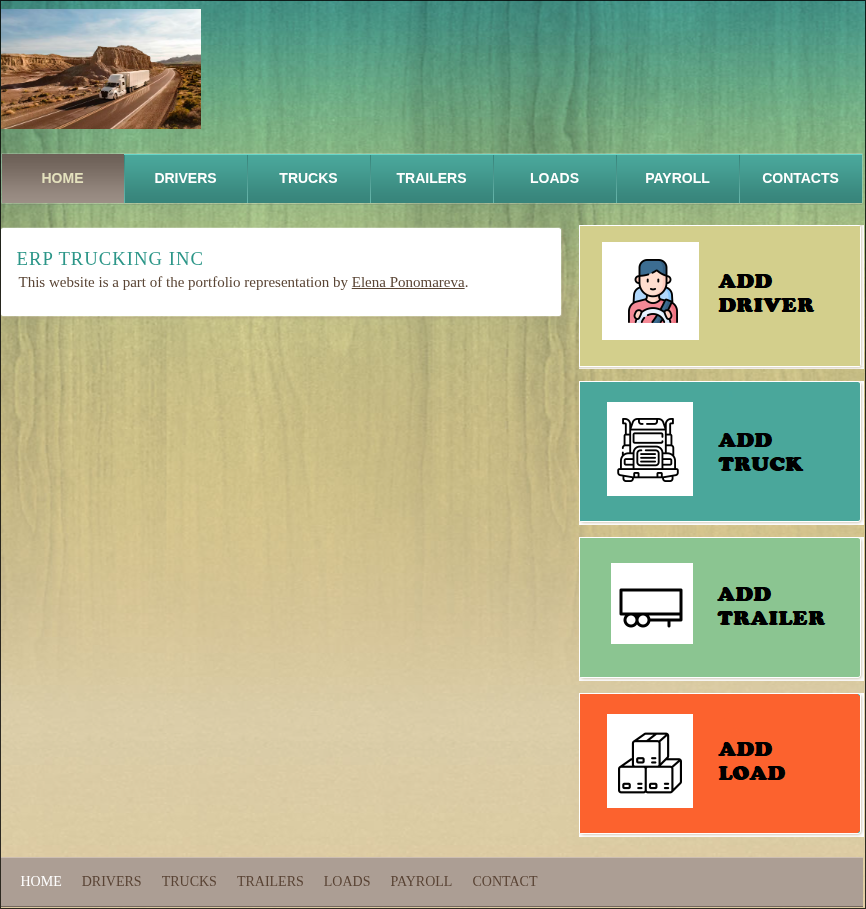

## Overview of the project for CS-499
This repository contains my ePortfolio and a final project for CS-499 Computer Science Capstone course, which documents my experience over the past few years. The ePortfolio content provides a solid starting point for develoiping ideas that demonstrate my skills in key areas of Computer Science. The included artifacts from some of the Computer Science courses reflect my growth in key categories: Software Design and Engineering, Algorithms and Data Structure, and Databases. The ePortfolio highlights a selected area of specialization in computer science and shows programming skills within that specialization. In ePortfolio, I demonstrated my experience with the Django web framework, Python programming skills, MySQL database, and frontend technologies.

## Informal Code Review
This code review provides a detailed walkthrough analysis that focuses on features, capabilities, target areas for improvement, and an enhancement plan that addresses the issues identified during the code review.

**The link to the [Code Review](https://youtu.be/HQdmOov7jRk).**

## Narrative:
+ **[Software Design and Engineering](https://github.com/Elena-R-P/ERP/blob/master/cs499/m3_2_software_design.pdf)**
In the CS-465: Full Stack Development course, we used the MEAN stack to build a web application for managing travel packages. We learned the principles, methods, and techniques used in systems development. In the project, we used the Model-View-Controller (MVC) design pattern, which separates the application into three interconnected parts. MVC helps to clearly separate the different functions of the application, making the code more organized and understandable.
For the Software Engineering and Design category, I expanded the complexity of a project and transferred it to other languages. The plan is to apply my knowledge of the logistic industry and create a Python-based software application that will help manage safety and accounting information and perform basic operations such as tracking equipment, storing driver information, and preparing payroll. The Django framework uses a variation of the MVC architecture called Model-View-Template (MVT). At this point, I have completed the application logic and created the necessary templates with “styles.css” file. In the CS-465 project, we used CRUD to manage information about travel packages. In the new project, I created new models (driver, truck, trailer, load) and used different classes and functions to provide required functionality to users.
sing a selected artifact from the CS-465: Full Stack Development course for the software engineering and design category, I have demonstrated the ability to gather requirements for a new system, determine necessary functionality, and use innovative technical skills and tools to develop a software application that solves a given problem. Through code review, I have demonstrated the ability to design, develop, and deliver professional-quality oral and visual communications that are coherent, technically sound, and appropriately adapted to specific audiences and contexts.

+ **[Algorithms and Data Structure](https://github.com/Elena-R-P/ERP/blob/master/cs499/m4_2_algorithms.pdf)**
In the CS-465: Full Stack Development course, we used the MEAN stack to build a web application for managing travel packages. In the projects, we used data types such as String, Date, Integer to store different values representing the trip name, description, trip date etc. In the algorithms and data structure category, I designed and evaluated computing solutions that solve a given problem using algorithmic principles and computer science practices and standards appropriate to its solution, while managing the trade-offs. I also demonstrated proficiency in Python by writing an algorithm to calculate driver payroll. 
After adding loads to the database and assigning each load to a driver (Pic. 1), we can create a payroll for the drivers. To calculate payroll, all loads delivered the week before (Monday through Saturday) will be added to the payroll. For example, picture 2, we want to create a payroll for 08/01/2025, meaning loads delivered between 07/21/2025 – 07/26/2025 will be included in the payroll. The algorithm (Pic 4) loops through all loads assigned to the driver, checks if they should be included, then sums up all the total costs and multiplies them by the discount percentage. Picture 3 shows that the payroll for driver Fuad was created with one load. To experiment, we go back to the Loads and change the delivery date for Load “New Yor, NY - Nashville, TN”. The new date is 07/26/2025, so we expect the load to appear on the payroll from 08/01/2025 (Pic 5). And the total cost changed to $5720.00 which is correct (($2500+$4000)*0.88)

+ **[Databases](https://github.com/Elena-R-P/ERP/blob/master/cs499/m5_2_databases.pdf)**
In the CS-465: Full Stack Development course, we used the MEAN stack to build a web application for managing travel packages. MEAN stack uses MongoDB database where data stored in JSON documents organized into collections. In the project we used CRUD operations to retrieve data, update and delete it from the database.
For the Databases category, I expanded the complexity of a project and used MySQL database to store information about drivers, trucks, trailers and loads. I demonstrated the ability to use innovative techniques, skills, and tools in computing practices for the purpose of implementing computer solutions that deliver value and accomplish industry-specific goals. Moreover, I expanded the complexity of the datasets and linked loads to a specific driver. Incorporating more advanced MySQL concepts can significantly improve database management skills and allow us to build more efficient, scalable, and secure applications. This is essential for optimizing resources and reducing infrastructure costs while managing the trade-offs involved in design choices.
When improving the project I learned about get_form_kwargs(self) method which is a standard method in Django’s class-based views responsible for returning a dictionary of keyword arguments (kwargs) that will be used to instantiate the form class associated with the view (Django, 2025). I used this method in LoadCreate() class in views.py (Pic 1), so I can connect the driver_id with the load on the front-end (Pic 2) and use this driver_id in “New Load” form (Pic 3 and Pic 4). Forms were created using Django forms and method {{ form.as_table }} to render a form in the template.

## Final project overview
Modifications and improvements made during the course CS-499. 
 
**The link to the [Project Overview](https://youtu.be/Z6razfMIG1c)**

### Self-Reflection
+ [What Makes a Productive Code Review?](https://github.com/Elena-R-P/ERP/blob/master/cs499/m2_1_paper.pdf)
+ [Marketing With ePortfolio](https://github.com/Elena-R-P/ERP/blob/master/cs499/m3_1_paper.pdf)
+ [Emerging Technology](https://github.com/Elena-R-P/ERP/blob/master/cs499/m6_1_paper.pdf) 
